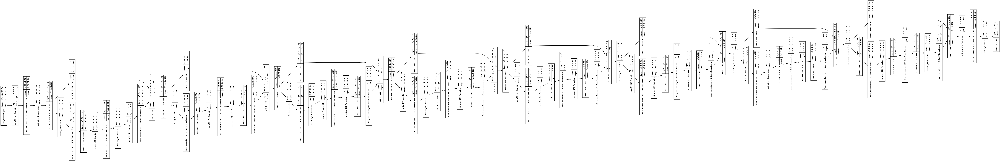

### ResNet implementation in Keras

This is an unoffcial implementation of the ResNet in Keras (concept and architectue: https://arxiv.org/pdf/1512.03385.pdf).

This implementation alows in a fexible way to generate the ResNet 18 and 34 model variants.
Other ResNet configurations (like number of resnet blocks, or filter number) can be easily changed. 
Identity shortcuts on dimension transition use 1x1 convolution to match the desired output, see the paper for details.

<p align="center"> 
  </a>
</p>

### How to use it?

1. clone the project
2. customize the block / filter lists from the notebook. Default configuration is the ResNet18 configuration ```block_list = [2,2,2,2]``` and
```filter_list = [64,128,256,512]```
3. Train the model on your data and use it in your projects

### Resources
1. [Deep Residual Learning for Image Recognition, Kaiming He, et all](https://arxiv.org/pdf/1512.03385.pdf)

/Enjoy.